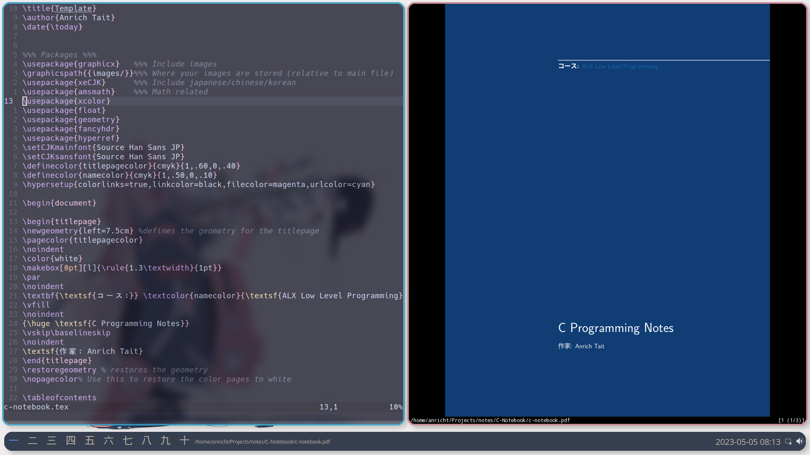
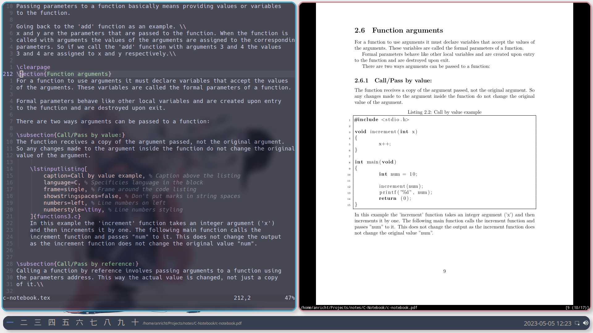

# Repo Description:
This repo is basically my school backpack, it contains all my digital notebooks (study related).

I created this repo to both keep all my notes saved somewhere and to share them with anyone interested.

# Explanation:
I write all my notes in Latex, obviously this can be tedious and take longer than hand writing them. 
Therefore I have made it easier in a couple of ways:
## The template:
I have created a template I use universally for all my notes. This makes it possible for me to copy the template
and rename the main .tex file to whatever notebook I am writing without having to worry about formatting and
packages. As such you will see that all my notebooks have math, japanese and programming capabilities.

## Gotta go fast:
To make common tasks (inserting code blocks, images and paragraphs, etc) quicker I have a custom library of snippets
I use that make these tasks almost instant. This is how I am able to write notes fast and on the fly.
I will include these snippets in my neovim config some time (maybe).

# The notebooks:
## C-Notebook:
I am currently studying Software Engineering and one of the focus languages is C, so this notebook is for that.

## Japanese Notebook:
Studying is hard but I find that spending time focused on something I enjoy is very important, so while I don't 
spend all my time on Japanese I do it as a passion project.

## Math Notebook:
This probably won't be updated often, due to me being a bit too busy right now to also study math.

## Some screenshots:

