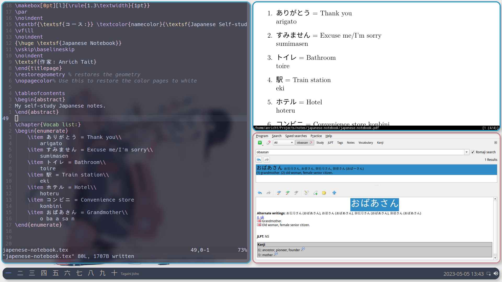

# Repo Description:
This repo is basically my school backpack, it contains all my digital notebooks
(study related).

I created this repo to both keep all my notes saved somewhere and to share them 
with anyone interested.

Join my study group on discord or just come hang out with me: 
https://discord.gg/HdsMTrUGau

# Explanation:
I write all my notes in Latex, obviously this can be tedious and take longer 
than hand writing them. 
Therefore I have made it easier in a couple of ways:
## The template:
I have created a template I use universally for all my notes. This makes it 
possible for me to copy the template
and rename the main .tex file to whatever notebook I am writing without having 
to worry about formatting and
packages. As such you will see that all my notebooks have math, japanese and 
programming capabilities.

## Gotta go fast:
To make common tasks (inserting code blocks, images and paragraphs, etc) quicker 
I have a custom library of snippets
I use that make these tasks almost instant. This is how I am able to write notes 
fast and on the fly.
I will include these snippets in my neovim config some time (maybe).

# The notebooks:
## C-Notebook:
I am currently studying Software Engineering and one of the focus languages is C, 
so this notebook is for that.

## Japanese Notebook:
On hold

## Bash Notebooks:
Part of my software engineering studies. I have also included some useful information 
that I learnt during my time using linux on my personal machine.

## Math Notebook:
I write most of my math notes on latex but do excercises and practice by hand. 
I have recently put more emphasis on my math seeing it now as more of a priority 
than my Japanese studies. So for now Japanese is on hold.

## Some screenshots:

## My study workflow: SQ3R
1. Create or enter the relevant notebook.
2. Open the relevant textbook.
3. Flip through each page of the chapter. Asses:
    - How long is the chapter?
    - What jumps out at you?
    - What should you expect from the upcoming chapter?
4. Check for a quiz at the end of the chapter.
    - This can give you an idea of what information to look for.
5. Start from the beginning of the chapter and read all the bold print.
6. Start from the beginning of the chapter and read the first and last sentence
of each paragraph.
7. Read the chapter and take notes.
    - When taking notes do your best to summarize the information.
    - Verbatim facts (understand the concept first) or mnemonics
    - Put concepts in your own words.
    - Write notes on the entire chapter and then do the excercises and examples. 
    This lets you check for holes in understanding.
